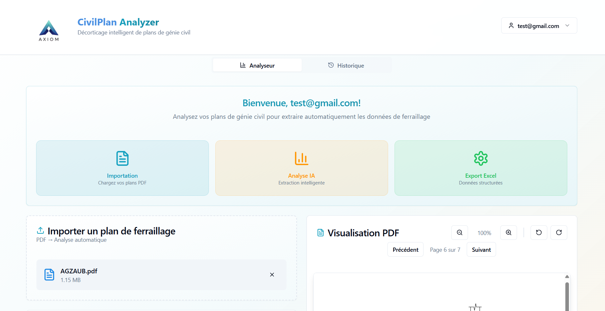

# Civil-Engineering-Plan-Extraction-Platform
Note: This repository is a documentation-only showcase. The source code and client data are not public due to confidentiality agreements with the company this project was built for. This page describes the system, the approach, and the measured impact — no proprietary code is included.
Context

An AI-powered platform that automates the manual reading of civil engineering construction plans — a task traditionally done by a team of people who go through each plan by hand to extract dimensions and identify every component needed for construction.

Problem

Reading and labeling construction plans manually is slow and error-prone: it used to take a dedicated team of 9 people to go through a plan, extract dimensions, and identify/tag every component required for construction. Errors introduced at this stage propagate downstream into procurement and construction, and are costly to catch late.

What the platform does
Extraction model — a Hugging Face extraction model, fine-tuned on construction plan data, pulls structured information (dimensions, labels, component references) out of the plan.
LLM-assisted structuring — the Anthropic API takes the raw extracted information and organizes it into a clean, structured format: readable construction tickets on one side, and a clear visual presentation (drawings/diagrams) on the other, so both the text output and the visual output are easy for a human to review.
Component tagging — every element on the plan is automatically labeled with the construction component it corresponds to, ready to feed into downstream planning/procurement.

The whole process — from raw plan to a fully labeled, dimensioned output — runs in about 2 minutes.

Impact
Reduced the team required for this task from 9 people to 1 person operating the platform.
Cut processing time from a manual, multi-person effort down to ~2 minutes per plan.
Reduced labeling/extraction errors by removing repetitive manual data entry from the process.
My role
Fine-tuned the Hugging Face extraction model on construction plan data.
Integrated the Anthropic API into the extraction pipeline for context-dependent information extraction.
Built the platform that ties both together into a single end-to-end workflow (upload plan → extraction → labeled output).
Why there's no code here

The implementation, fine-tuned model weights, and the construction plans used for training/evaluation are confidential and belong to the company this was built for. This repository exists so the approach and results can still be discussed and reviewed publicly, without exposing anything proprietary.

  

